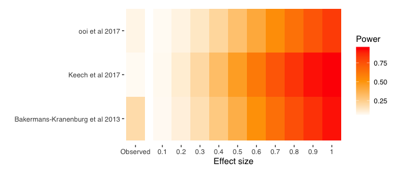

# metameta: A Meta-meta-analysis Package for R

<!-- badges: start -->

[](https://zenodo.org/badge/latestdoi/279281549)
[](https://travis-ci.com/dsquintana/metameta)
<!-- badges: end -->

## Description

The `metameta` package is a collection of functions for
meta-meta-analyses in R, which is useful for re-analyzing published
meta-analysis. Functions are available to calculate the statistical
power for each study in a meta-analysis, based on data that is typically
reported in meta-analyses, and for creating a “Firepower” plot, which
visualizes the median power of a meta-analysis assuming a range of true
effect sizes.

## Usage

### Install the package

``` r
devtools::install_github("dsquintana/metameta")
```

### Calculate power for studies included in a published meta-analysis.

The `mapower_se` function can calculate power for a range of “true”
effect sizes: The reported summary effect size estimate and a range of
effects from 0.1 to 1 (in increments of 0.1). Here, we’re only showing
the first 6 columns for the purposes of illustration, although the
function calculates power for 11 true effect sizes in total. We’re also
making our calculations based on reported effect sizes and standard
errors

``` r
library(metameta)
library(dplyr)
```

``` r
power_ooi <- mapower_se(dat = dat_ooi, observed_es = 0.178, name = "ooi et al 2017")
power_ooi_dat <- power_ooi$dat
power_ooi_dat <- power_ooi_dat %>% select(1:6) # Select first 6 columns
power_ooi_dat
#>             study     yi   sei power_es_observed power_es01 power_es02
#> 1 anagnostou_2012  1.187 0.479        0.06596450 0.05500761 0.07020009
#> 2     andari_2010  0.155 0.380        0.07549262 0.05797045 0.08229066
#> 3      dadds_2014 -0.230 0.319        0.08636394 0.06133177 0.09610698
#> 4      domes_2013 -0.185 0.368        0.07720550 0.05850133 0.08446626
#> 5      domes_2014  0.824 0.383        0.07508974 0.05784552 0.08177903
#> 6     gordon_2013 -0.182 0.336        0.08272160 0.06020765 0.09147592
#> 7  guastella_2010  0.235 0.346        0.08082964 0.05962295 0.08907113
#> 8 guastella_2015b  0.069 0.279        0.09777789 0.06484272 0.11062850
#> 9   watanabe_2014  0.245 0.222        0.12627341 0.07355100 0.14689796
```

We can also perform the same analysis using effect size and confidence
interval data, using the `mapower_ul` function. As before, only a small
selection of columns are printed for the purposes of
demonstration.

``` r
power_keech <- mapower_ul(dat = dat_keech, observed_es = 0.08, name = "Keech et al 2017")
power_keech_dat <- power_keech$dat
power_keech_dat <- power_keech_dat %>% select(1:6) # Select first 6 columns
power_keech_dat
#>                  study    yi lower upper       sei power_es_observed
#> 1      anagnostou_2012  0.79 -0.12  1.71 0.4668367        0.05337078
#> 2       brambilla_2016  0.15 -0.22  0.52 0.1887755        0.07081577
#> 3           davis_2013  0.11 -0.68  0.90 0.4030612        0.05452497
#> 4           domes_2013 -0.18 -0.86  0.50 0.3469388        0.05611304
#> 5         einfeld_2014  0.22 -0.06  0.51 0.1454082        0.08533524
#> 6  fischer-shofty_2013  0.07 -0.20  0.35 0.1403061        0.08799827
#> 7          gibson_2014 -0.12 -1.13  0.89 0.5153061        0.05276549
#> 8          gordon_2013 -0.15 -0.51  0.20 0.1811224        0.07263326
#> 9       guastella_2010  0.59  0.07  1.12 0.2678571        0.06028006
#> 10      guastella_2015  0.05 -0.54  0.64 0.3010204        0.05812977
#> 11        jarskog_2017 -0.30 -0.83  0.23 0.2704082        0.06008590
#> 12        woolley_2014 -0.01 -0.29  0.26 0.1403061        0.08799827
```

### Create a Firepower plot

Sometimes it’s useful to calculate the statistical power for a body of
meta-analyses, which might be reported in the same article or across
articles. Illustrating the power of individual studies from multiple
meta-analyses can be difficult to interpret if there are many studies.
An alternative is to illustrate the power per meta-analysis by
calculating the mean power across studies. We can illustrate this with a
“Firepower” plot. This plot visualizes the median power assuming the
observed effect size in the meta-analysis is the true effect size as
well as assuming a range of true effect sizes ranging from 0.1 to 1 (in
increments of 0.1).

``` r
library(metameta)

### Calcuate median power for three meta-analyses
power_ooi <- mapower_se(dat = dat_ooi, observed_es = 0.178, name = "ooi et al 2017")
power_med_ooi <- power_ooi$power_median_dat

keech_power <- mapower_ul(dat = dat_keech, observed_es = 0.08, name = "Keech et al 2017")
power_med_keech <- keech_power$power_median_dat

power_bakermans_kranenburg <- 
  mapower_se(dat = dat_bakermans_kranenburg, observed_es = 0.32, 
             name = "Bakermans-Kranenburg et al 2013")
power_med_bakermans_kranenburg <- power_bakermans_kranenburg$power_median_dat

### Create a list
list_power <- list(power_med_ooi, power_med_keech, power_med_bakermans_kranenburg)

### Run firepower function
fp <- firepower(list_power)

### Create firepower plot
fp_plot <- fp$fp_plot
fp_plot
```

<!-- -->
