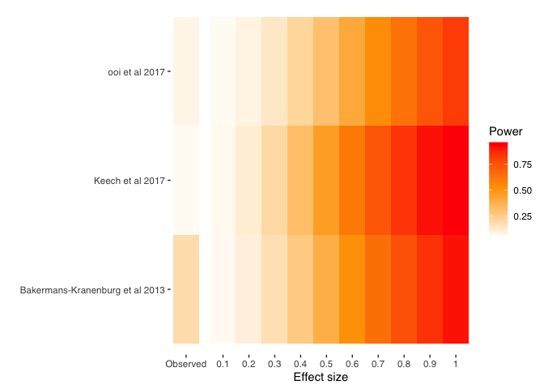

# metameta: A Meta-meta-analysis Package for R

## Description

The `metameta` package is a collection of functions for
meta-meta-analyses in R, which is useful for re-analysing published
meta-analysis. Functions are available to calculate the statistical
power for each study in a meta-analysis, based on data that is typically
reported in meta-analyses, and for creating a “Firepower” plot, which
visualises the median power of a meta-analysis assuming a range of true
effect sizes.

## Usage

Install the package

``` r
devtools::install_github("dsquintana/metameta")
```

## Usage

Calculate power for studies included in a published meta-analysis. Power
for a range of “True” effect sizes are calculated: The reported summary
effect size estimate, and a range of effects from 0.1 to 1 (in
increments of 0.1).

``` r
library(metameta)

power_ooi <- mapower_se(dat = dat_ooi, observed_es = 0.178, name = "ooi et al 2017")
power_ooi_dat <- power_ooi$dat
power_ooi_dat
```

    ##             study     yi   sei power_es_observed power_es01 power_es02
    ## 1 anagnostou_2012  1.187 0.479        0.06596450 0.05500761 0.07020009
    ## 2     andari_2010  0.155 0.380        0.07549262 0.05797045 0.08229066
    ## 3      dadds_2014 -0.230 0.319        0.08636394 0.06133177 0.09610698
    ## 4      domes_2013 -0.185 0.368        0.07720550 0.05850133 0.08446626
    ## 5      domes_2014  0.824 0.383        0.07508974 0.05784552 0.08177903
    ## 6     gordon_2013 -0.182 0.336        0.08272160 0.06020765 0.09147592
    ## 7  guastella_2010  0.235 0.346        0.08082964 0.05962295 0.08907113
    ## 8 guastella_2015b  0.069 0.279        0.09777789 0.06484272 0.11062850
    ## 9   watanabe_2014  0.245 0.222        0.12627341 0.07355100 0.14689796
    ##   power_es03 power_es04 power_es05 power_es06 power_es07 power_es08 power_es09
    ## 1 0.09600885  0.1329123  0.1811344  0.2403309  0.3093471  0.3861194  0.4677631
    ## 2 0.12388674  0.1834106  0.2602580  0.3517963  0.4531615  0.5577867  0.6585384
    ## 3 0.15584029  0.2407347  0.3475299  0.4685433  0.5926765  0.7081144  0.8054789
    ## 4 0.12891562  0.1924855  0.2742829  0.3710429  0.4770141  0.5847244  0.6864111
    ## 5 0.12270447  0.1812750  0.2569475  0.3472283  0.4474544  0.5512713  0.6517049
    ## 6 0.14512845  0.2216170  0.3187926  0.4309246  0.5491190  0.6631253  0.7638103
    ## 7 0.13956543  0.2116454  0.3036501  0.4107655  0.5252134  0.6376561  0.7393036
    ## 8 0.18936228  0.2996944  0.4334386  0.5755899  0.7085000  0.8179082  0.8972154
    ## 9 0.27185491  0.4372489  0.6149795  0.7711816  0.8836025  0.9498747  0.9818740
    ##   power_es1
    ## 1 0.5508401
    ## 2 0.7490878
    ## 3 0.8799693
    ## 4 0.7756045
    ## 5 0.7424799
    ## 6 0.8452396
    ## 7 0.8238693
    ## 8 0.9478404
    ## 9 0.9945289

Create a firepower plot, which visualises the median power for assuming
the observed effect size in the meta-analysis is the true effect size
and assuming a range of true effect sizes ranging from 0.1 to 1 in
increments of 0.1.

``` r
library(metameta)

### Calcuate median power for three meta-analyses
power_ooi <- mapower_se(dat = dat_ooi, observed_es = 0.178, name = "ooi et al 2017")
power_med_ooi <- power_ooi$power_median_dat

keech_power <- mapower_ul(dat = dat_keech, observed_es = 0.08, name = "Keech et al 2017")
power_med_keech <- keech_power$power_median_dat

power_bakermans_kranenburg <- 
  mapower_se(dat = dat_bakermans_kranenburg, observed_es = 0.32, 
             name = "Bakermans-Kranenburg et al 2013")
power_med_bakermans_kranenburg <- power_bakermans_kranenburg$power_median_dat

### Create a list
list_power <- list(power_med_ooi, power_med_keech, power_med_bakermans_kranenburg)

### Run firepower function
fp <- firepower(list_power)

### Create firepower plot
fp_plot <- fp$fp_plot
fp_plot
```

<!-- -->
